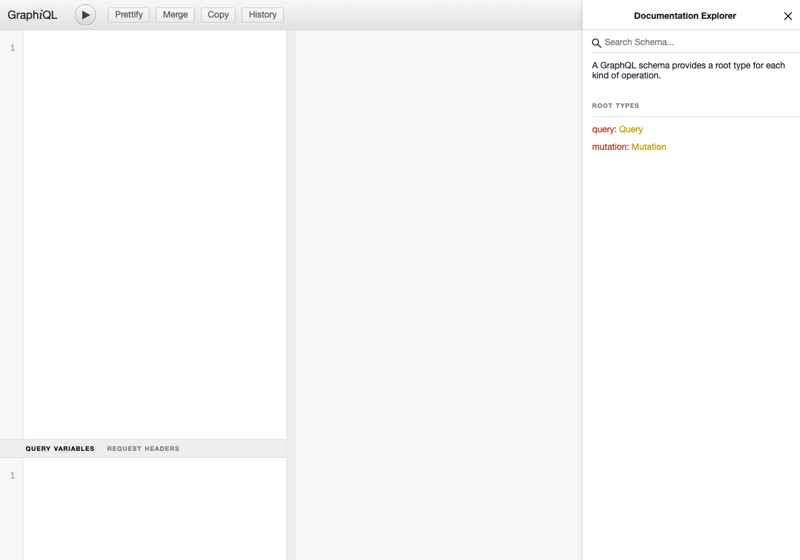

# API

## Production Notes

TBD

## Development Notes

* API domain: api.dev.popai.insure
* GraphQL API url: https://api.dev.popai.insure/graphql/
* To access API, it will need a **VPN connection** in order to access.
  * *new devs: ask management to obtain the `Open VPN` key.*
* Hosted on Google Cloud

## API Notes

* `Vue Apollo` is handling communication between Vue and GraphQL core packages.
* Queries/Mutations should be written inside API module. Modules should be stored at `src/core/api/modules` folder.
* There is a main API class with default methods to use. Check `src/core/api/main.js` and `src/core/api/modules/Auth.js` for better understanding.
* To check API documentation access https://api.dev.popai.insure/graphql/ through browser or any GraphQL client.

<div align="center" style="margin: 15px 0;">
<br>
<em>GraphQL Web Client</em>
</div>

## Writing Queries/Mutations

* Name queries/mutations.
* Make good use of GraphQL variables. Try to always force variable as required (the ! mark).
* Try to use indentantion and new lines to help readbility.
* Just return the fields you will use, avoid mapping all fields if they are not necessary.
* GraphQL will cache results in its own state management system. If a query is used in several places, try to map same fields to make use of caching feature.
* Make a better use of `fetchPolicy` feature. The `fetchPolicy` option allows you to customize how the query will use the Apollo Client cache.
  * Available values are:
    * `cache-first` (default): return result from cache. Only fetch from network if cached result is not available.
    * `cache-and-network`: return result from cache first (if it exists), then return network result once it's available.
    * `cache-only`: return result from cache if available, fail otherwise.
    * `network-only`: return result from network, fail if network call doesn't succeed, save to cache.
    * `no-cache`: return result from network, fail if network call doesn't succeed, don't save to cache.
  * Most cases `cache-and-network` will be enough. Use `no-cache` only for information that needs to be updated at all costs.
* API supports polling. To enable, set `pollInterval` option to any value (in milliseconds).
* `Vue Apollo` supports writing queries in SFC files. But for this project it is not recommended, since we use Vuex to Handle `Vue => Store => API` communication.
* Avoid using Apollo specific template tags to write queries. https://apollo.vuejs.org/guide/components/

### Examples:

```js
// BAD
gql`query () { fetchUser(username: ${username}") { id, name, email, ... } }`
```

```js
// BAD
gql`query fetchUser($username: String!) {
  fetchUser(username: $username)) {
    id,
    name,
    email,
    ...
  }
}`
```

**Further info:**

* https://graphql.org/learn/queries/
* https://apollo.vuejs.org/guide/apollo/queries.html
* https://apollo.vuejs.org/api/smart-query.html#options
